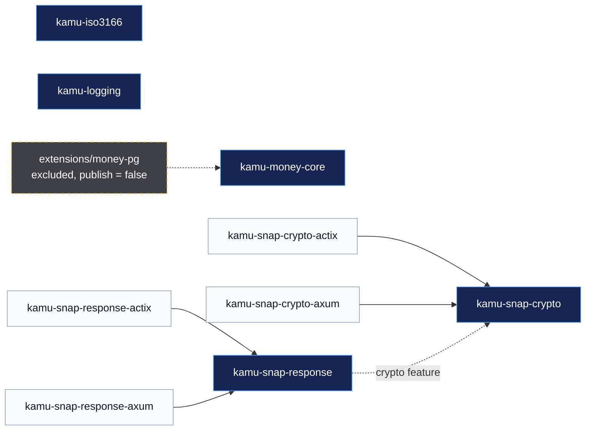

# kamu-public-crates

<div align="center">

**Small Rust libraries for exact money, Indonesian payments, country data, and production tracing.**

[](https://github.com/pt-immer/kamu-public-crates/actions/workflows/on-pr-synced.yml)
[](Cargo.toml)
[](#license)

Nine independently versioned public crates. One deliberately excluded PostgreSQL extension lane.

[Choose a crate](#choose-a-crate) ·
[See the architecture](#architecture) ·
[Start contributing](#development) ·
[Read the release model](CONTRIBUTING.md#releasing-a-crate)

</div>

## Choose a crate

| You need | Start here | Important property |
| --- | --- | --- |
| ISO 3166 country or subdivision types | [`kamu-iso3166`](crates/iso3166) | `no_std`, zero-allocation lookups, generated tables |
| One tracing setup across native, systemd, wasm, and OTLP | [`kamu-logging`](crates/logging) | Explicit process-global subscriber ownership |
| Exact ISO 4217 arithmetic and typed FX rates | [`kamu-money-core`](crates/money-core) | Fixed scale, compile-time currency, explicit residue decisions |
| SNAP BI request signing or verification | [`kamu-snap-crypto`](crates/snap-crypto) | Validated request boundaries and framework-free crypto |
| SNAP BI response envelopes and error taxonomy | [`kamu-snap-response`](crates/snap-response) | Valid success/failure states by construction |
| Actix Web or axum integration | A thin `*-actix` or `*-axum` adapter | Framework glue stays outside the domain crates |

## Architecture

Arrows mean “depends on.” Dashed edges are optional or outside the published
workspace.



## Public crate inventory

| Crate | Current source version | Documentation |
| --- | ---: | --- |
| [`kamu-iso3166`](crates/iso3166) | [](https://crates.io/crates/kamu-iso3166) | [docs.rs](https://docs.rs/kamu-iso3166) |
| [`kamu-logging`](crates/logging) | [](https://crates.io/crates/kamu-logging) | [docs.rs](https://docs.rs/kamu-logging) |
| [`kamu-money-core`](crates/money-core) | `0.1.0` · first release pending | [crate guide](crates/money-core/README.md) |
| [`kamu-snap-crypto`](crates/snap-crypto) | [](https://crates.io/crates/kamu-snap-crypto) | [docs.rs](https://docs.rs/kamu-snap-crypto) |
| [`kamu-snap-response`](crates/snap-response) | [](https://crates.io/crates/kamu-snap-response) | [docs.rs](https://docs.rs/kamu-snap-response) |
| [`kamu-snap-crypto-actix`](crates/snap-crypto-actix) | [](https://crates.io/crates/kamu-snap-crypto-actix) | [docs.rs](https://docs.rs/kamu-snap-crypto-actix) |
| [`kamu-snap-crypto-axum`](crates/snap-crypto-axum) | [](https://crates.io/crates/kamu-snap-crypto-axum) | [docs.rs](https://docs.rs/kamu-snap-crypto-axum) |
| [`kamu-snap-response-actix`](crates/snap-response-actix) | [](https://crates.io/crates/kamu-snap-response-actix) | [docs.rs](https://docs.rs/kamu-snap-response-actix) |
| [`kamu-snap-response-axum`](crates/snap-response-axum) | [](https://crates.io/crates/kamu-snap-response-axum) | [docs.rs](https://docs.rs/kamu-snap-response-axum) |

Each crate owns its version and changelog. Source versions can lead crates.io
while a release is being prepared.

### The excluded PostgreSQL lane

[`extensions/money-pg`](extensions/money-pg) is a nested Cargo workspace for the
`kmoney` pgrx extension and its YugabyteDB harness. It is not a tenth public
crate and cannot be built by the root `--workspace` commands. The separation
keeps pgrx patches, profiles, lockfiles, and Docker-heavy validation out of the
nine crates that ship to crates.io.

Use `just pg <recipe>` to enter that lane. Its
[`DESIGN.md`](extensions/money-pg/DESIGN.md) defines the boundary; the
[`RUNBOOK.md`](extensions/money-pg/kamu-money-pg/yb/RUNBOOK.md) covers
YugabyteDB adoption and rollback.

## Development

Clone recursively because `kamu-iso3166` reads a vendored Git submodule at
build time:

```sh
git clone --recurse-submodules https://github.com/pt-immer/kamu-public-crates.git
cd kamu-public-crates
python3 scripts/dev_environment.py setup
export PATH="$PWD/.tools/bin:$PATH"
just doctor
```

The normal loop is short:

```sh
just check-all  # fast: format, Clippy, tests
just gate       # complete barrier for the nine public crates
just ci         # gate plus package dry-runs
```

If the extension lane changed:

```sh
just gate-all   # public-crate gate plus the developer lane gate
```

Extension releases additionally require `just pg gate-pg-release`, which builds
the native extension against YugabyteDB and runs the cluster suites.

`cargo-nextest` runs ordinary tests in isolated processes. It does not run
doctests, so every repository recipe pairs nextest with `cargo test --doc`.
Feature matrices are selected per crate: workspace-wide `--all-features` is
invalid because some target and backend features are mutually exclusive.

See [`CONTRIBUTING.md`](CONTRIBUTING.md) for commits, releases, and data updates.
Automation details live in [`AGENTS.md`](AGENTS.md).

## Quality policy

- Rust 1.94.0 is the public-workspace MSRV. Rust 1.96.0 owns primary and
  compile-fail checks; CI also tests current stable.
- Warnings and Clippy findings are denied.
- Unsafe Rust is forbidden in ISO and SNAP crates. The extension confines
  required ABI `unsafe` to `src/ffi/` and tests that boundary structurally.
- Generated ISO 3166 and ISO 4217 tables are checked from vendored source data.
- Coverage floors are enforced for domain crates; thin framework adapters are
  compile-gated.
- Dependency, Markdown, TOML, spelling, shell, and repository-scrub checks are
  part of the gate.

## License

Crate source is available under either the
[Apache License 2.0](LICENSE-APACHE) or [MIT license](LICENSE-MIT).

`kamu-iso3166` additionally embeds ISO 3166 data under CC BY-SA 4.0; see its
[`NOTICE`](crates/iso3166/NOTICE) and
[`VENDORED.md`](crates/iso3166/VENDORED.md).

`kamu-money-core` redistributes the ISO 4217 register with separate attribution;
see its [`NOTICE`](crates/money-core/NOTICE) and
[`VENDORED.md`](crates/money-core/VENDORED.md).
