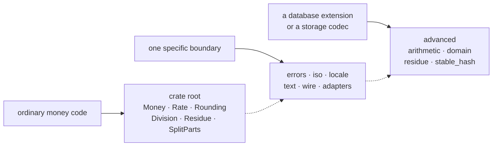
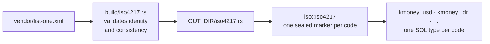
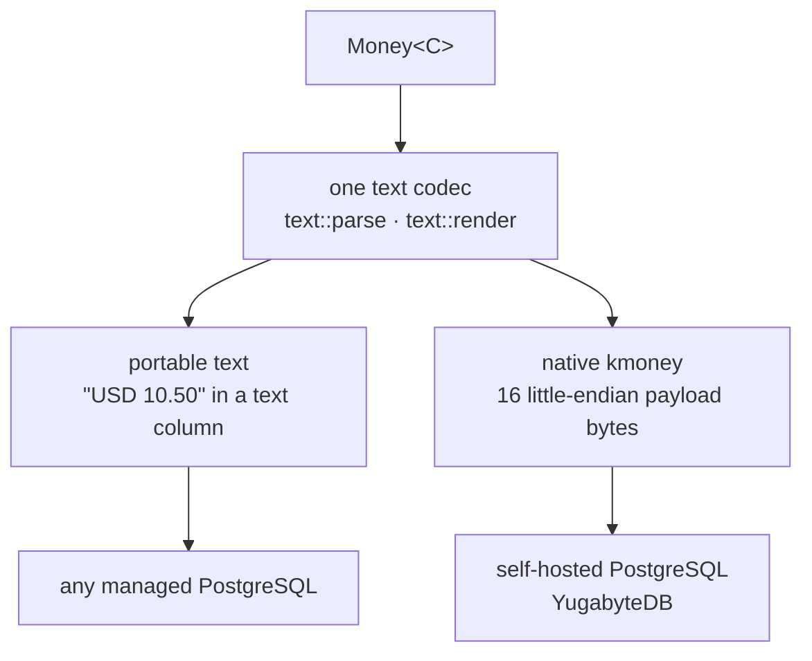

# kamu-money-core — design

> A stored amount is the truth. Formatting may pad it; no boundary may silently
> round, truncate, saturate, redenominate, or discard it.

Everything below follows from that rule. What the crate *promises* is stated on
the types themselves and proved by their tests; this document carries only what
no mechanism can hold: the shape, the constraints other systems impose, and the
designs deliberately not taken.

## The shape

The public surface telescopes by audience, not by layer count.

`src/` mirrors this: a directory or file name is its public path wherever one
exists, so `advanced::arithmetic` is `arithmetic/` and `wire::transparent` is
`wire/transparent.rs`. Locating code needs no search.

`advanced` is not a junk drawer. It is the raw-unit contract the PostgreSQL
extension is built on, and the only reason it is public.

## The register

The vendored XML is the only place a currency fact exists. The generated set is
closed, and its identity facts — codes and numeric values — are append-only,
because stored payloads and persisted `stable_hash` values resolve against them.
Update the XML, `NOTICE` and `VENDORED.md` together; never hand-edit generated
tables.

## The PostgreSQL boundary

Two storage routes, one codec.

The native route lives in the excluded
[`extensions/money-pg`](../../extensions/money-pg) workspace. Its shape matters
here because this crate's register defines it: one SQL type per currency, so a
cross-currency expression fails while the query is parsed rather than at run
time. `kmoney_mixed` stores heterogeneous currencies and deliberately has no
arithmetic and no sum aggregate. The currency lives in the catalog, not the
value, which is why a pinned payload is 16 bytes and `kmoney_mixed` appends two
ISO-code bytes for 18.

That lane owns its own [`DESIGN.md`](../../extensions/money-pg/DESIGN.md) and
[YugabyteDB runbook](../../extensions/money-pg/kamu-money-pg/yb/RUNBOOK.md).

## External constraints

Facts other systems own, which the design works around rather than solves.

| Constraint | Consequence here |
| --- | --- |
| PostgreSQL `numeric` rounds over-precise input before `CHECK` or `DOMAIN` can inspect it | Storage is canonical text, never `NUMERIC` |
| Rust's orphan rule (`E0117`) | The `postgres` and `sqlx` adapters live in this crate, not sibling crates |
| Cargo features unify across a dependency graph | The wire mode is chosen per field, never by a feature |
| Rust has no linear types | `Residue` is `#[must_use]`, and `Drop` never panics |
| `str` equality is not const-stable | Two `LocalePolicy` presets are struct literals; a `const` item cannot reach `try_with_separators` |
| ISO settlement exponent is not a display policy | IDR settles at two digits and commonly renders at zero; canonical text follows settlement |

## Rejected alternatives

| Alternative | Reason rejected |
| --- | --- |
| `rust_decimal::Decimal` as storage or compute representation | Does not cover the canonical domain while preserving a fixed structural scale |
| Runtime-currency `Money` with fallible arithmetic | Allows calculation before currency identity is proved |
| `Iterator::sum()` through `Add` | A transient out-of-domain partial makes results order-dependent |
| Infallible `Summation`/`Overflow` mirroring `Division`/`Residue` | An overflowing sum splits nothing, and nothing bounds its excess, so the accessor would be fallible |
| A separate const parser for `money!` | Two parsers for one text format diverge silently; the existing parser gained `const` instead |
| PostgreSQL `NUMERIC` storage | Over-precise ingress can round before constraints inspect it |
| Separate public driver-adapter crates | Orphan rules prevent the required trait implementations |
| Untagged binary `i128` | Lets bytes written as one currency decode as another |
| Cargo-feature-selected wire format | Feature unification silently couples unrelated consumers |
| `Rate::inverse()` or `Rate::compose()` | Fabricates trade semantics or a quote the holder does not possess |
| `Mul<Rate>` for `Money` | An operator that fails on ordinary in-domain input is a lie |
| Saturating construction | Saturation is not a money policy; construction outside the domain is refused |
| Native pgrx crate in the public workspace | Would impose patches, profiles, toolchain and database builds on unrelated crates |
